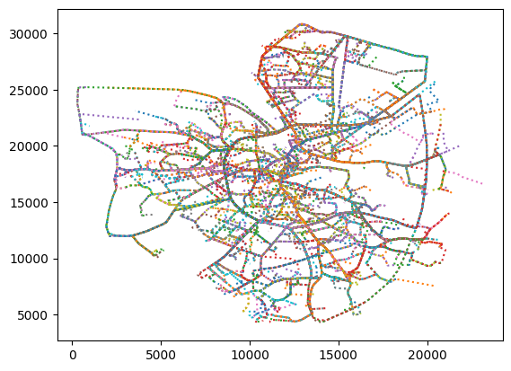

# Private-Trace-Synthesis
Algorithms for synthesizing differentially-private traces.

### Installation
```bash
pip3 install -r requirements.txt
```

### Brinkhoff dataset
We use pre-generated [Brinkhoff data](https://github.com/git-disl/AdaTrace/blob/master/brinkhoff.dat) from the AdaTrace repository. This dataset contains 20,000 synthetic traces.

Suppose we downloaded the data to `~/Downloads/brinkhoff.dat`. To visualize the dataset, change working directories to `scripts/data` and run

```bash
python3 plot_trajectories.py --file ~/Downloads/brinkhoff.dat
```

This will produce something similar to the following:



### AdaTrace
To compile AdaTrace, clone [their repository](https://github.com/git-disl/AdaTrace/blob/master). Then change directories to `AdaTrace/src/` and do:

```bash
javac -cp ../commons-math3-3.4.1.jar:../kd.jar expoimpl/*.java *.java
```

To create 5 synthetic datasets using AdaTrace, first move `brinkhoff.dat` to `AdaTrace/src/`. Then do:

```bash
java -cp .:../commons-math3-3.4.1.jar:../kd.jar Main
```

The 5 datasets should now be in the current directory. To evaluate these datasets, first create the directory `AdaTrace/src/SYNTHETIC-DATASETS/` and move synthesized datasets there. Then do:

```bash
java -cp .:../commons-math3-3.4.1.jar:../kd.jar Experiments
```

Example results:

```
Filename:                       brinkhoff.dat-eps1.0-iteration0.dat
Query AvRE:                     0.10578427372064991
Location coverage kendall-tau:  0.7259920634920635
Frequent pattern F1:            0.68
Frequent pattern support:       0.42459108223522285
Trip error:                     0.01919559574935812
Diameter error:                 0.026553808548257285
Length error:                   0.05082140129080564
```

Below is an example of a dataset of Brinkhoff synthesized using AdaTrace with `ε = 1`):


### GAN Experiments

To train a vanilla GAN on Brinkhoff, change directories to `scripts/`, make sure `brinhoff.dat` is in the current directory and do:

```bash
python3 -u train.py --fpath brinkhoff.dat --save_path ../images/synthesis/vanilla/ --tiny 0
```

Using a simple GAN with no privacy, we produce the following 20,000 traces at 2000 epochs:


And at 13000 epochs we get:


Scores are (* means we do better):

```
Filename:                       public-gan.dat          brinkhoff.dat-eps1.0-iteration0.dat
*Query AvRE:                    0.07663956899182468     0.10578427372064991
Location coverage kendall-tau:  0.6784523809523809      0.7259920634920635
Frequent pattern F1:            0.53                    0.68
Frequent pattern support:       0.7274587704979105      0.42459108223522285
Trip error:                     0.09878842858777957     0.01919559574935812
Diameter error:                 0.04040937756783465     0.026553808548257285
Length error:                   0.1808399631440616      0.05082140129080564
```

At 3000 epochs, scores are:

```
Filename:                       public-gan.dat          brinkhoff.dat-eps1.0-iteration0.dat
*Query AvRE:                    0.05595802327291127     0.10578427372064991
*Location coverage kendall-tau: 0.7358333333333333      0.7259920634920635
Frequent pattern F1:            0.63                    0.68
Frequent pattern support:       0.5864136727030113      0.42459108223522285
Trip error:                     0.07436397572967487     0.01919559574935812
Diameter error:                 0.03077201828143057     0.026553808548257285
Length error:                   0.15743568535397803     0.05082140129080564
```

At 5000 epochs:

```
Filename:                       public-gan.dat          brinkhoff.dat-eps1.0-iteration0.dat
*Query AvRE:                    0.028146547445979442    0.10578427372064991
*Location coverage kendall-tau: 0.7406746031746032      0.7259920634920635
Frequent pattern F1:            0.61                    0.68
Frequent pattern support:       0.5314850423844831      0.42459108223522285
Trip error:                     0.053613072058763596    0.01919559574935812
*Diameter error:                0.013600251015592455    0.026553808548257285
Length error:                   0.09558990550827025     0.05082140129080564
```

At 13000 epochs:

```
Filename:                       public-gan.dat          brinkhoff.dat-eps1.0-iteration0.dat
*Query AvRE:                    0.04230939531525398     0.10578427372064991
*Location coverage kendall-tau: 0.7559920634920635      0.7259920634920635
Frequent pattern F1:            0.66                    0.68
*Frequent pattern support:      0.3586430371981911      0.42459108223522285
Trip error:                     0.050683045080263334    0.01919559574935812
*Diameter error:                0.008101308895193405    0.026553808548257285
*Length error:                  0.04971716163705869     0.05082140129080564
```

At 15000 epochs:

```
Filename:                       public-gan.dat          brinkhoff.dat-eps1.0-iteration0.dat
*Query AvRE:                    0.029894383218779765    0.10578427372064991
*Location coverage kendall-tau: 0.7732936507936508      0.7259920634920635
*Frequent pattern F1:           0.71                    0.68
*Frequent pattern support:      0.2834304722670945      0.42459108223522285
Trip error:                     0.051443139331389866    0.01919559574935812
*Diameter error:                0.006277135780115614    0.026553808548257285
*Length error:                  0.046926810938924285    0.05082140129080564
```

We also try a tiny GAN, which obtains (820 epochs)

```bash
python3 -u train.py --fpath brinkhoff.dat --save_path ../images/synthesis/tiny/ --tiny 1
```

```
Filename:                       public-gan.dat          brinkhoff.dat-eps1.0-iteration0.dat
Query AvRE:                     0.11798949194063456     0.10578427372064991
Location coverage kendall-tau:  0.6638492063492063      0.7259920634920635
Frequent pattern F1:            0.48                    0.68
Frequent pattern support:       1.1275608115817066      0.42459108223522285
Trip error:                     0.22076443233704635     0.01919559574935812
Diameter error:                 0.06777863541331408     0.026553808548257285
Length error:                   0.24211632049734993     0.05082140129080564
```


### Private GAN

To train a differentially private GAN with `ε = 1.5` on Brinkhoff, do:

```bash
python3 -u train_edp.py --epochs 15000 --batch_size 64 --noise_multiplier 1.5 --fpath brinkhoff.dat --save_path ../images/synthesis/edp-gan/ --tiny 1
```

We try to train a private GAN using differentially-private SGD for the discriminator only. At 15000 epochs:


```
Filename:                       public-gan.dat          brinkhoff.dat-eps1.0-iteration0.dat
Query AvRE:                     0.636400129979293       0.10578427372064991
Location coverage kendall-tau:  0.4899603174603175      0.7259920634920635
Frequent pattern F1:            0.18                    0.68
Frequent pattern support:       3.3810501418785424      0.42459108223522285
Trip error:                     0.620681087727295       0.01919559574935812
Diameter error:                 0.4988209244361573      0.026553808548257285
Length error:                   0.4482031507718248      0.05082140129080564
```

### Creating a synthetic dataset using the trained generator

If you used the vanilla GAN example command above, you should be able to find `images/synthesis/vanilla/E15000.pkl`. Copy that to `scripts/` and run:

```bash
python3 -u synthesize.py --save_dat public-gan.dat --noise_size=32 --hidden_size=32 --model_path E01000.pkl --cap 10 --tiny 0 --bn 1
```

This will produce `public-gan.dat` in the current directory, which you can evaluate using the AdaTrace evaluation commands shown above.
